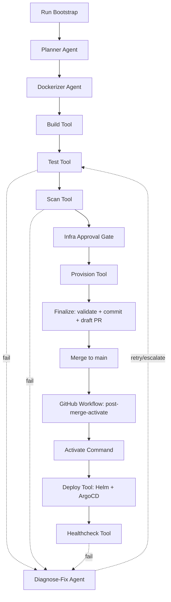

# Overview and Architecture

Pipeline Setup Orchestrator is a thin multi-agent system that takes an application repository, generates CI/CD plus GitOps assets, and activates deployment through a post-merge automation path.

## Product Summary

DevOps AI Agent is positioned as: from app repo to live deployment, with spec-driven orchestration, deterministic execution, and safety controls.

The orchestrator coordinates three judgment agents over deterministic tools:
- Planner
- Dockerizer
- Diagnose-Fix

Deterministic execution runs through Docker, test runner, scan tooling, Helm, ArgoCD, and cluster tooling.

## Core Principle

Agents do judgment. Tools do execution. Humans govern risk boundaries.

- LLM agents reason where ambiguity exists.
- Deterministic tools run provision, build, test, scan, deploy, and healthcheck.
- Destructive operations are controlled by orchestration policy. Current post-merge activation uses non-interactive deploy approval for automated rollout, with an optional future GitHub Environment gate.

## Agent Reality Contract

This project does not treat agents as static templates. Agent outputs must be app-specific and evidence-based.

1. Planner contract
- Must inspect repo files using read/list capabilities.
- Must identify language/framework/entrypoint/ports/tests from evidence.
- Must mark unknowns explicitly rather than guessing.

2. Dockerizer contract
- Must generate framework-specific Dockerfiles from the current BuildPlan and repo evidence.
- Must not default to generic runtime commands that ignore app type.
- Must validate through deterministic build attempts with bounded retries.

3. Diagnose-Fix contract
- Must investigate failed-step output and relevant artifacts before proposing a fix.
- Must preserve guardrails: never weaken tests/scans, never rewrite app source code.

## Components

### Orchestrator (thin supervisor)

The orchestrator decomposes goals, sequences steps, routes work, carries shared state, and enforces policy. It does not perform deterministic work itself.

### Judgment agents

1. Planner: inspects repo and produces BuildPlan (language, framework, ports, dependencies, stateful, DB need, test command).
2. Dockerizer: generates a working Dockerfile specific to the app and validates buildability.
3. Diagnose-Fix: investigates failed deterministic steps and proposes safe remediation or escalation.

### Deterministic tools

- provision_infra
- build_image
- run_tests
- scan_image
- deploy
- healthcheck

### Shared state

A typed PipelineState carries plan, Dockerfile reference, image reference, scan report, manifests, approvals, and step status.

## Architecture Diagram



## End-to-End Flow

### Phase A: Bootstrap (pre-merge)

```text
[orchestrator run bootstrap]
   -> Planner (agent)
   -> Dockerizer (agent) + build (tool)
   -> test (tool), scan (tool) with Diagnose-Fix retry loop
   -> infra approval + provision
   -> finalize: validate artifacts, commit, draft PR
```

### Phase B: Activation (post-merge automation)

```text
[GitHub workflow on main]
   -> orchestrator activate (non-interactive)
   -> deploy (Helm + ArgoCD)
   -> healthcheck
```

This split ensures ArgoCD only syncs after deploy assets exist on the tracked revision.

## Safety and Blast Radius

- No standing cloud-admin credentials for agents.
- Destructive operations run only via deterministic tools and policy checks.
- Deploy tool validates GitOps source revision/path before ArgoCD sync.
- Audit log records key decisions, retries, and escalations.

## Scope and Evolution

Immediate architecture priority remains Real LLM Agent Core: tool-using Planner, Dockerizer, and Diagnose-Fix with app-diverse behavior and anti-template regression tests.

See:
- setup and operations: docs/02-setup-and-operations.md
- demo plan and roadmap: docs/03-demo-and-roadmap.md
